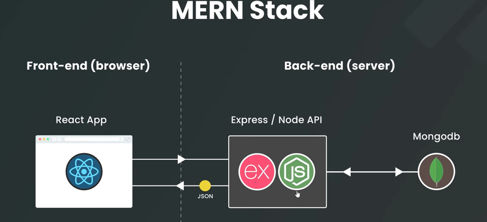

# mern-stack

The MERN stack is a popular JavaScript-based technology stack used for building full-stack web applications, consisting of MongoDB (database), Express.js (backend framework), React (frontend library), and Node.js (runtime environment). It enables developers to build dynamic, responsive applications using a single language, JavaScript, throughout the entire client-server-database architecture. 

# Component Breakdown
## M — MongoDB:
 A NoSQL, document-oriented database that stores data in JSON-like documents, offering high flexibility and scalability.

## E — Express.js: 
A minimal backend web framework for Node.js that simplifies routing, handling HTTP requests, and managing API endpoints.

## R — React.js: 
A frontend JavaScript library for building interactive, high-performance user interfaces using components.

## N — Node.js: 
A JavaScript runtime environment that allows developers to run JavaScript on the server-side, enabling efficient non-blocking operations. 

# How MERN Works Together

- Client (React): User interacts with the web application in the browser.

- Server (Node/Express): Handles API requests from the frontend, executes server-side logic, and connects to the database.

- Database (MongoDB): Stores, retrieves, and manages data in JSON format

### FrontEnd
-----------------

react application runs in the browser to power the website and typically handles routing as well to handle different website pages.

Then when we need to show data in the website like blogs or even just to authenticate users we'd send a request from the FrontEnd to the BackEnd 

### BackEnd
-----------------

It is an express app running in node.js environments

express is just a framework for node that lets us create APIs.

express and nodejs will 
handle:
- handle our requests on the backend and typically interact with a database to get data , or update or delete data, etc.

- authenticating requests: 
  - like log user in, log out, or sign them up.

once it has data from the database it would then send a response with that data back to the browser ; the client.

And the React App would handle that response by outputting the data into some kind of template.

So whatss the point of the middle node API step in order to fetch the data?

why cant we just use directly from FrontEnd to MongoDB?
Because there might be sensitive data and we need to protect it properly.

[ Client (React) ] ---> [ Server (Node.js + Express) ] ---> [ Database (MongoDB) ]

+-------------------+       +---------------------+       +------------------+
|   React Client    | ----> |     API Routes      | ----> |   Controllers    |
| (Fetch / Axios)   |       |  /api/users         |       |  Business Logic  |
+-------------------+       +---------------------+       +------------------+
                                      |
                                      v
                             +------------------+
                             |     Models       |
                             |   (Mongoose)     |
                             +------------------+
                                      |
                                      v
                             +------------------+
                             |     MongoDB      |
                             |   Database       |
                             +------------------+

Response Flow:
MongoDB → Models → Controllers → API Routes → React (JSON Response)

