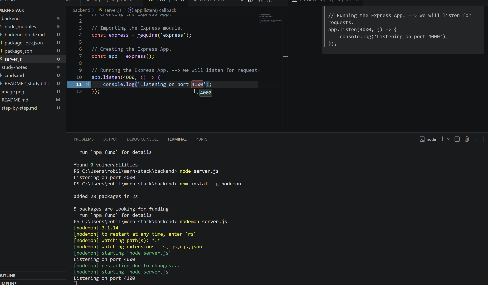

# cmds

npm init -y
```
Error
------

npm : File C:\Program Files\nodejs\npm.ps1 cannot be loaded because running scripts is disabled on this system. For more information, see 
about_Execution_Policies at https:/go.microsoft.com/fwlink/?LinkID=135170.
At line:1 char:1
+ npm init -y
+ ~~~
    + CategoryInfo          : SecurityError: (:) [], PSSecurityException
    + FullyQualifiedErrorId : UnauthorizedAccess


Resolution
-----------

Get-ExecutionPolicy -List

        Scope ExecutionPolicy
        ----- ---------------
MachinePolicy       Undefined
   UserPolicy       Undefined
      Process       Undefined
  CurrentUser       Undefined
 LocalMachine       Undefined


PS C:\Users\robil\mern-stack\backend> 
PS C:\Users\robil\mern-stack\backend> Set-ExecutionPolicy RemoteSigned -Scope CurrentUser
PS C:\Users\robil\mern-stack\backend> Set-ExecutionPolicy RemoteSigned -Scope CurrentUser
PS C:\Users\robil\mern-stack\backend> npm init -y                                        
Wrote to C:\Users\robil\mern-stack\backend\package.json:

{
  "name": "backend",
  "version": "1.0.0",
  "description": "",
  "main": "server.js",
  "scripts": {
    "test": "echo \"Error: no test specified\" && exit 1",
    "start": "node server.js"
  },
  "keywords": [],
  "author": "",
  "license": "ISC",
  "type": "commonjs"
}


```


# Nodemon

```
Nodemon is a popular open-source development tool for Node.js applications that automatically restarts the server whenever file changes are detected in the directory. 

It eliminates the need to manually stop and restart the application after every code change, significantly improving developer productivity.

Key Aspects of Nodemon:
-------------------------

- Automatic Restart: 
It monitors files (specifically .js, .mjs, .cjs, .json) and restarts the application automatically when a change is saved.

- Ease of Use: 
It acts as a wrapper around the node command; you can run nodemon app.js instead of node app.js.

- Development Only: 
It is designed specifically for the development phase, not for production, to speed up the workflow.

- Customizable: 
Supports ignoring specific files/directories, watching specific directories, and running other executables (like Python or Ruby). 


Installation:
You can install it globally using npm:
npm install -g nodemon 
```


## meaning of : npm install -g nodemon?

```
-g = global

It installs the package once for your entire system, not just inside one project.

So instead of:

installing inside a single project folder

It installs:

available everywhere on your computer (cool stuff!)


output:
-------
npm install -g nodemon

added 28 packages in 2s

5 packages are looking for funding
  run `npm fund` for details

```

Think of it like this: -->

-g = “install it in your computer toolbox”

no -g = “install it inside this one project box”


so everytime you run : nodemon server.js , and make a change in the files. the program will restart.

